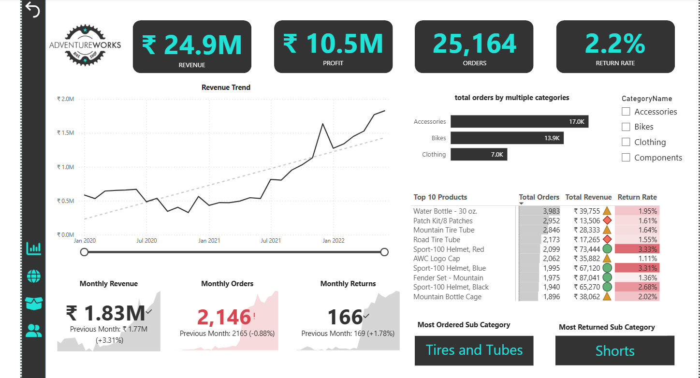
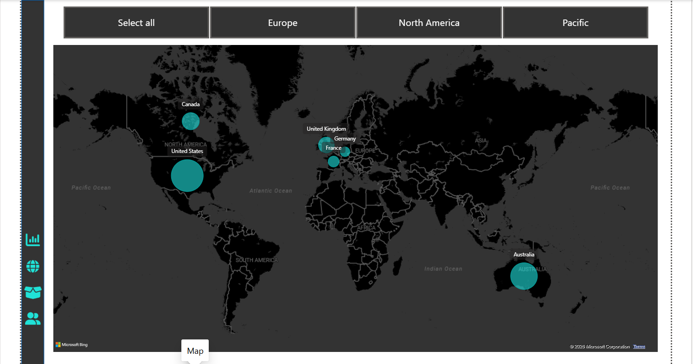
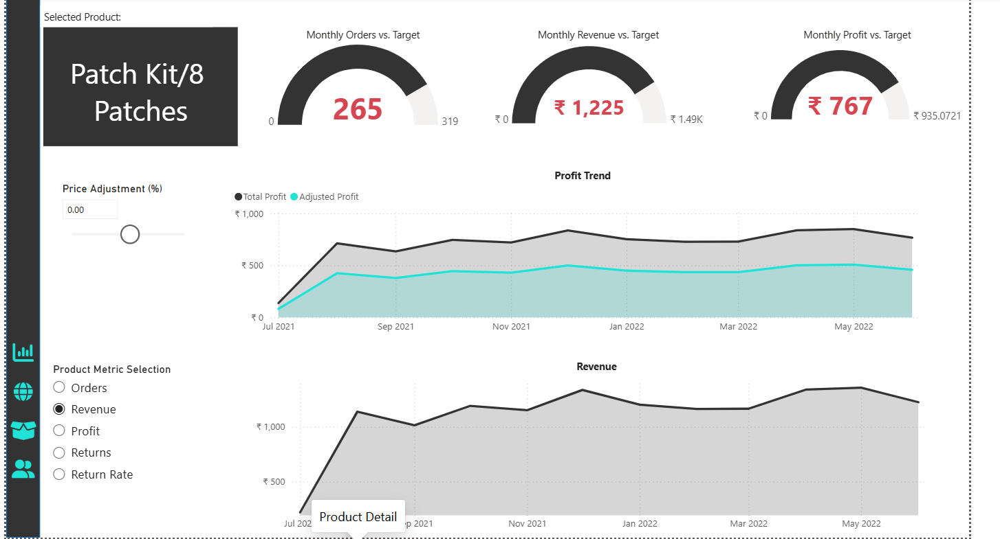
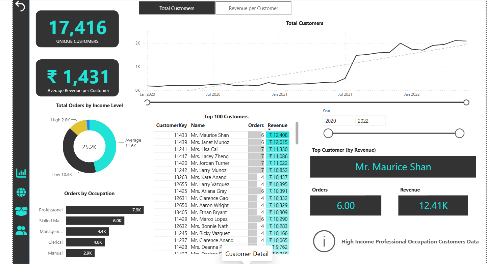

# 📊 Adventure Works Sales Dashboard | Power BI

## 📌 Project Overview

This project presents an interactive **Power BI dashboard** built using the **Adventure Works** dataset. The dashboard helps analyze business performance by tracking sales, profit, customer behavior, product performance, and geographical trends.

The goal of this project is to convert raw business data into meaningful insights that support data-driven decision-making.

---

## 🎯 Business Objectives

- Monitor Revenue, Profit, Orders, and Return Rate.
- Analyze product and category performance.
- Identify top-performing customers.
- Track monthly business trends.
- Compare regional sales performance.
- Support business decisions using interactive dashboards.

---

## 🛠️ Tools & Technologies

- Microsoft Power BI
- Power Query
- DAX (Data Analysis Expressions)
- Data Modeling
- Adventure Works Dataset

---

## 📈 Dashboard Pages

### 1️⃣ Executive Dashboard

Provides a high-level overview of business performance.

**KPIs**
- Total Revenue
- Total Profit
- Total Orders
- Return Rate

**Visuals**
- Revenue Trend
- Monthly Revenue
- Monthly Orders
- Monthly Returns
- Product Category Analysis
- Top 10 Products
- Return Rate Analysis

---

### 2️⃣ Geographical Analysis

Analyzes sales performance across different regions.

**Features**
- Interactive World Map
- Region Filters
- Sales Distribution
- Country-wise Performance

Regions Covered:
- Europe
- North America
- Pacific

---

### 3️⃣ Product Analysis

Provides detailed product performance insights.

**KPIs**
- Orders vs Target
- Revenue vs Target
- Profit vs Target

**Features**
- Product Selection
- Price Adjustment Simulation
- Profit Trend
- Revenue Trend
- Product Metrics

---

### 4️⃣ Customer Analysis

Analyzes customer purchasing behavior.

**KPIs**
- Total Customers
- Average Revenue per Customer

**Visuals**
- Customer Growth Trend
- Top 100 Customers
- Income Level Analysis
- Occupation Analysis
- Top Customer by Revenue

---

## 📊 Key KPIs

| KPI | Description |
|------|-------------|
| Revenue | Total sales generated |
| Profit | Total business profit |
| Orders | Total number of customer orders |
| Return Rate | Percentage of returned products |
| Monthly Revenue | Revenue trend over time |
| Monthly Orders | Monthly order count |
| Monthly Returns | Monthly returned products |
| Top Products | Best-selling products |
| Top Customers | Highest revenue-generating customers |

---

## 📷 Dashboard Screenshots

### Executive Dashboard



---

### Geographical Analysis



---

### Product Analysis



---

### Customer Analysis



---

## 📌 Business Insights

- Revenue showed consistent growth over time.
- Accessories generated the highest number of orders.
- Tires and Tubes emerged as the most ordered sub-category.
- Shorts recorded the highest product return rate.
- High-income professional customers contributed significantly to total revenue.
- North America generated the highest sales among all regions.

---

## 🚀 Skills Demonstrated

- Data Cleaning using Power Query
- Data Modeling
- DAX Measures
- KPI Development
- Interactive Dashboard Design
- Drill-through Navigation
- Geographic Analysis
- Customer Segmentation
- Product Performance Analysis
- Business Intelligence Reporting

---

## 📁 Repository Structure

```
Adventure-Works-PowerBI-Dashboard
│
├── AdventureWorksDashboard.pbix
├── README.md
├── Screenshots
│   ├── 01_Executive_Dashboard.png
│   ├── 02_Geographical_Analysis.png
│   ├── 03_Product_Detail.png
│   └── 04_Customer_Detail.png
└── Documentation
    └── Project_Summary.pdf
```

---

## 👨‍💻 Author

**Shashank S**

**Data Analyst**

### Technical Skills

- SQL
- Power BI
- Python
- Pandas
- NumPy
- Excel
- DAX
- Power Query

---

⭐ If you found this project useful, feel free to **star** this repository!
